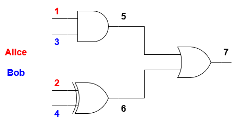

# 安全多方计算

## 项目介绍

项目使用姚氏乱码电路协议实现两方安全计算。
在我们的模型中，两方 Alice 和 Bob 在他们的输入上计算一个函数，而不与对方共享他们的输入值。Alice 是电路创建者（乱码者），而 Bob 是电路评估者。Alice 创建了 yao 电路并将其与她的加密输入一起发送给 Bob。Bob 然后计算结果并将它们发送回 Alice。

安装依赖:
```sh
pip3 install --user pyzmq cryptography sympy
```

将此存储库克隆到您想要的任何位置，然后按照下一节中的说明进行操作。

## 使用

#### 通过网络
1. 默认情况下，所有测试都在本地网络上完成。您可以在util.py中编辑网络信息。
2. 运行服务器（鲍勃）make bob：.
3. 在另一个终端中，使用circuits/中的一个json电路运行客户端（Alice） ：make <circuit-name>例如make bool。您还可以运行 make alice以一次评估电路中的所有电路。

Alice 将为 Alice-Bob 输入的所有组合打印电路的真值表。Alice 不知道 Bob 的输入，但仅出于打印真值表的目的，Alice 假设 Bob 的输入遵循特定顺序。

Makefile 包含最有用的命令，但您也可以直接使用脚本：
```sh
./main.py bob  # Run Bob side
./main.py alice -c <circuit.json>  # Run Alice side
./main.py -h  # See all available options
```

#### 本地测试
打印电路的真值表:
```sh
./main.py local -c <circuit.json>
```

打印电路乱码表:
```sh
./main.py local -c <circuit.json> -m table
```

## 项目架构
该项目由4个python文件组成：

* **main.py**  实现 Alice 端、Bob 端和本地测试。
* **yao.py** 实现：
    * 加密和解密功能。
    * Bob 使用评估函数来获得 yao 电路的结果
    * GarbledCircuit 生成电路的密钥、p 位和乱码门的类。
    * GarbledGate 生成门的乱码表的类。
* **ot.py** ot.py实现了不经意的传输协议。
* **util.py** 实现了许多与网络通信和非对称密钥生成相关的功能。

电路/中提供了一些转换为布尔电路的函数。

## JSON电路
使用可用门将函数表示为布尔电路：
* NOT (1-input gate)
* AND
* OR
* XOR
* NAND
* NOR
* NXOR

做了几个假设：

* Bob 知道函数的布尔表示。因此，“隐匿不安全”的原则受到尊重。
* 所有的门都有一个或两个输入，只有一个输出。
* 编号较低的门的输出将始终连接到编号较高的门和/或定义为电路输出。
* 门 id 是门输出的 id。


## 例子


这是上述电路的 json 表示:
```json
{
  "name": "smart",
  "circuits": [
    {
      "id": "Smart",
      "alice": [1, 2],
      "bob": [3, 4],
      "out": [7],
      "gates": [
        {"id": 5, "type": "AND", "in": [1, 3]},
        {"id": 6, "type": "XOR", "in": [2, 4]},
        {"id": 7, "type": "OR", "in": [5, 6]}
      ]
    }
  ]
}
```

下面是前面json电路的真值表:
```sh
$ ./main.py local -c circuits/smart.json
======== Smart ========
  Alice[1, 2] = 0 0 Bob[3, 4] = 0 0  Outputs[7] = 0
  Alice[1, 2] = 0 0 Bob[3, 4] = 0 1  Outputs[7] = 1
  Alice[1, 2] = 0 0 Bob[3, 4] = 1 0  Outputs[7] = 0
  Alice[1, 2] = 0 0 Bob[3, 4] = 1 1  Outputs[7] = 1
  Alice[1, 2] = 0 1 Bob[3, 4] = 0 0  Outputs[7] = 1
  Alice[1, 2] = 0 1 Bob[3, 4] = 0 1  Outputs[7] = 0
  Alice[1, 2] = 0 1 Bob[3, 4] = 1 0  Outputs[7] = 1
  Alice[1, 2] = 0 1 Bob[3, 4] = 1 1  Outputs[7] = 0
  Alice[1, 2] = 1 0 Bob[3, 4] = 0 0  Outputs[7] = 0
  Alice[1, 2] = 1 0 Bob[3, 4] = 0 1  Outputs[7] = 1
  Alice[1, 2] = 1 0 Bob[3, 4] = 1 0  Outputs[7] = 1
  Alice[1, 2] = 1 0 Bob[3, 4] = 1 1  Outputs[7] = 1
  Alice[1, 2] = 1 1 Bob[3, 4] = 0 0  Outputs[7] = 1
  Alice[1, 2] = 1 1 Bob[3, 4] = 0 1  Outputs[7] = 0
  Alice[1, 2] = 1 1 Bob[3, 4] = 1 0  Outputs[7] = 1
  Alice[1, 2] = 1 1 Bob[3, 4] = 1 1  Outputs[7] = 1
```

这是乱码门的清晰表示:
```sh
$ ./main.py local -c circuits/smart.json -m table
======== Smart ========
P-BITS: {1: 0, 2: 1, 3: 0, 4: 0, 5: 1, 6: 0, 7: 0}
GATE: 5, TYPE: AND
[0, 0]: [1, 0][3, 0]([5, 0], 1)
[0, 1]: [1, 0][3, 1]([5, 0], 1)
[1, 0]: [1, 1][3, 0]([5, 0], 1)
[1, 1]: [1, 1][3, 1]([5, 1], 0)
GATE: 6, TYPE: XOR
[0, 0]: [2, 1][4, 0]([6, 1], 1)
[0, 1]: [2, 1][4, 1]([6, 0], 0)
[1, 0]: [2, 0][4, 0]([6, 0], 0)
[1, 1]: [2, 0][4, 1]([6, 1], 1)
GATE: 7, TYPE: OR
[0, 0]: [5, 1][6, 0]([7, 1], 1)
[0, 1]: [5, 1][6, 1]([7, 1], 1)
[1, 0]: [5, 0][6, 0]([7, 0], 0)
[1, 1]: [5, 0][6, 1]([7, 1], 1)
```

